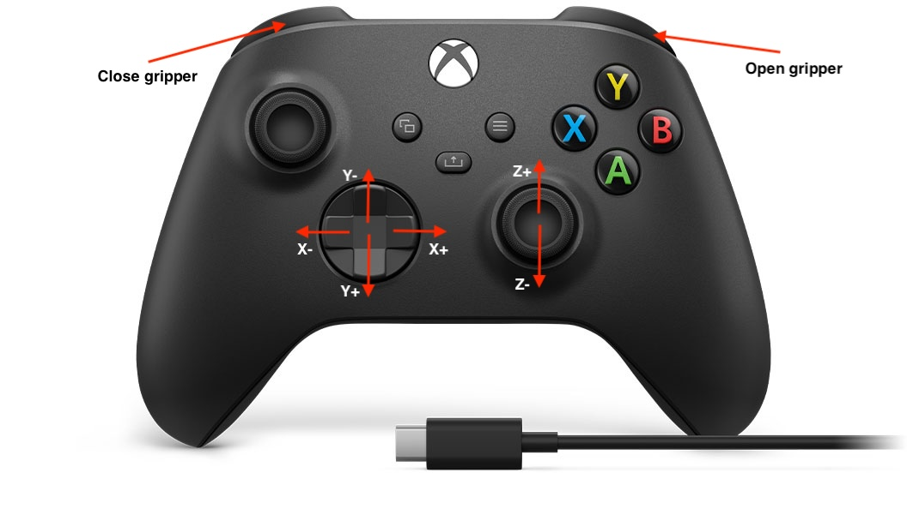

# PHIRL with Kinova

This repository contains code for **collecting demonstrations**, **annotating demonstrations**, and a **Gymnasium-compatible environment** for brushing knots off a plushie using a **Kinova Gen3 Lite** robot.

---

## Table of Contents

1. [Setup](#setup)
2. [Recording Demonstrations](#recording-demonstrations)
3. [Replaying Demonstrations](#replaying-demonstrations)
4. [Running the Gym Environment](#running-the-gym-environment)
5. [Important Notes](#important-notes)

---

## Setup

### Prerequisites

* **ROS Noetic** installed and configured
* **Python 3** with required packages

  * *(TODO: list dependencies and add `requirements.txt`)*
* **Kinova Kortex ROS driver** installed
* **USB camera** (for perception)
* **Xbox controller** (for teleoperation)

---

### Environment Setup

1. Source your ROS environment:

```bash
source /opt/ros/noetic/setup.bash
source ~/catkin_ws/devel/setup.bash  # if using a catkin workspace
```

2. Ensure the **Kinova Gen3 Lite**, **Xbox controller**, and **USB camera** are connected.

3. Launch the required ROS nodes:

```bash
./start_ros_nodes.sh
```

This script starts:

* The Kinova Kortex driver
* The joystick (`joy`) node
* The USB camera node

4. Verify that the USB camera node is using the correct device:

```bash
ffplay /dev/video2
```

Update the camera device in `start_ros_nodes.sh` if needed.

5. Ensure that the physical plushie is set up to be compatible with the BrushPerception's bounding boxes and saturation detection by running:

```bash
python3 env/test_perception.py
```

---

## Recording Demonstrations

To record a teleoperated demonstration:

1. Start the teleoperation loop:

```bash
python3 demonstrations/teleop_loop.py
```

2. Wait until the log message appears:

```
Controller Node ready!
```

This node:

* Polls the Xbox controller
* Commands the robot arm
* Publishes actions for recording

<p align="center">
  
  <br>
  <em>Xbox controller mapping for teleoperation</em>
</p>


3. Start the demonstration recorder:

```bash
python3 demonstrations/demo_recorder.py <demo_name>
```

4. A directory will be created at:

```
demonstrations/bags/<demo_name>
```

5. Press:

* **`s`** to start recording
* **`e`** to stop recording

---

## Replaying Demonstrations

To replay and annotate a recorded demonstration:

1. Ensure the physical environment is reset to the starting state. 

2. Run the demo replayer:

```bash
python3 demonstrations/demo_replayer.py <demo_name> <num_chunks>
```

3. The trajectory will be split into `<num_chunks>` segments for annotation.

4. After the final annotation, a file named `progress.txt` will be saved to:

```
demonstrations/bags/<demo_name>
```

---

## Running the Gym Environment

The `BrushEnv` implements the **Gymnasium environment interface** and communicates with the robot via ROS.

### Important

Your training or evaluation loop **must be a ROS node**.

1. Ensure `demonstrations/teleop_loop.py` is **not running**.

2. See `run_experiment.py` for a full example. A minimal usage example:

```python
import rospy
from envs.brush_env import BrushEnv, StateSpace

rospy.init_node('run_testing', anonymous=True)

env = BrushEnv(state_space=StateSpace.CARTESIAN)
observation, info = env.reset()

for step in range(10):
    action = env.action_space.sample()
    observation, reward, terminated, truncated, info = env.step(action)

    if terminated or truncated:
        break

env.close()
```

---

## Important Notes

* Ensure the **USB camera node** is launched with the correct `/dev/video*` device.
* Ensure the physical position of the plushie is aligned with the bounding box of the BrushPerception module. 
